# 00.Prompt-Engineering-Project-with-GenAI


## 01 Crear el entorno virtual

Abrir un nuevo terminal y correr el siguiente código

```
python 00-create_venv.py
```
Activa el entorno virtual según las indicaciones 

```
source .venv/bin/activate
```
## 02 Installar los requerimientos

Correr el siguiente código
```
python 01-install_requirements.py
```
### PARTE 01: Crear los accesos a Vertex AI en la plataforma 

A. Ingresar a la plataforma mediante este enlace 

https://cloud.google.com/storage?utm_source=google&utm_medium=cpc&utm_campaign=latam-LATAM-all-es-dr-BKWS-all-all-trial-b-dr-1710136-LUAC0020202&utm_content=text-ad-none-any-DEV_c-CRE_654758081477-ADGP_Hybrid+%7C+BKWS+-+BRO+%7C+Txt_Storage-Cloud+Storage-KWID_43700076071239172-kwd-11012518454&utm_term=KW_google+cloud+storage-ST_google+cloud+storage&gclsrc=aw.ds&gad_source=1&gad_campaignid=19960229427&gclid=CjwKCAjwkvbEBhApEiwAKUz6-25dwkwtV5XaLennt0eCgD0lfQFIufJvtHrFKdOK2wp6hqSovdLhZhoCoRcQAvD_BwE

Ir a consola 

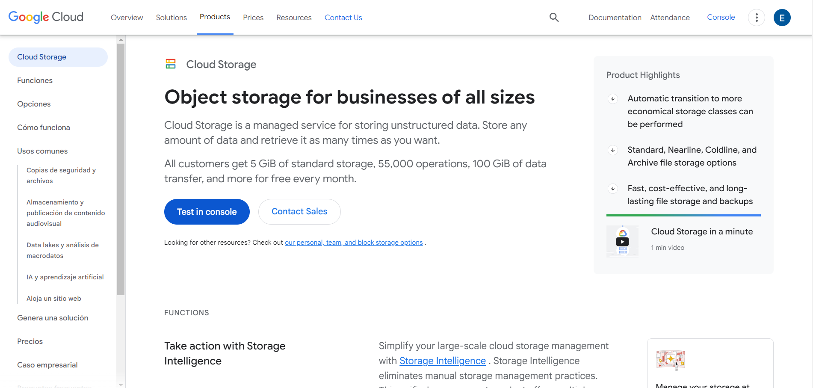

#Crear un nuevo projecto 

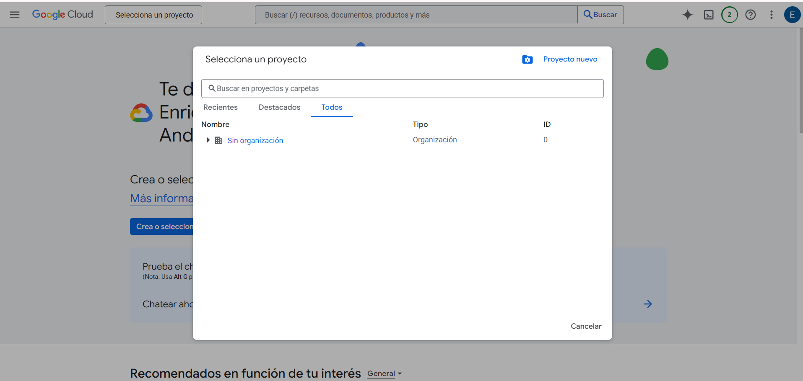

#Colocas un numbre cualquiera 

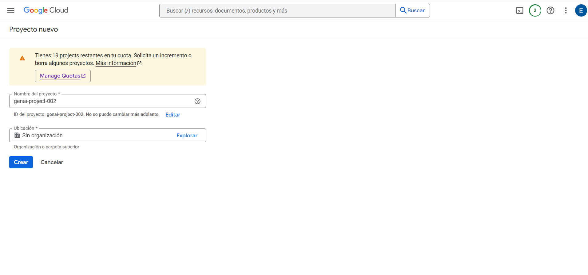

# Vas a IAM -> Service Account 

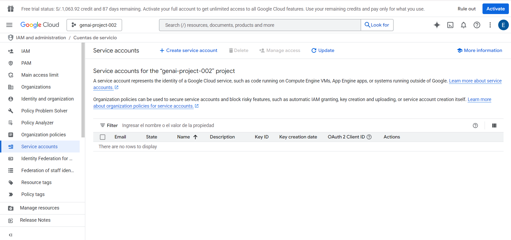

# Crea un service acount  y colocale un nombre 
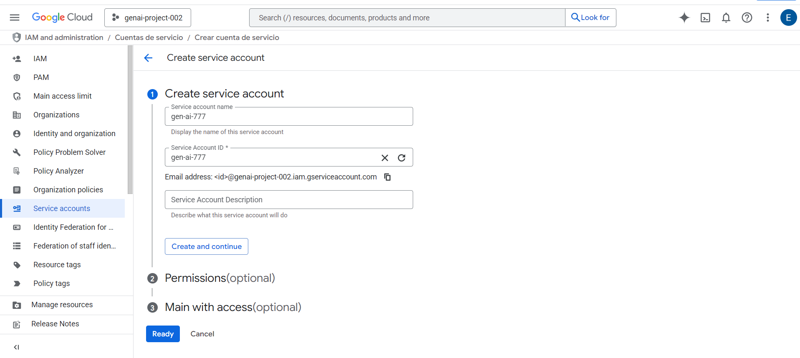

# Darle el rol de Vertex AI User 

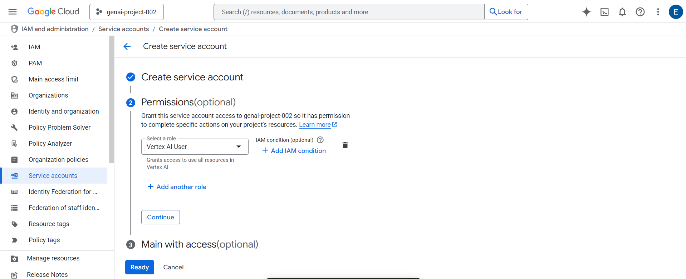

# ingresas a la cuenta creada 

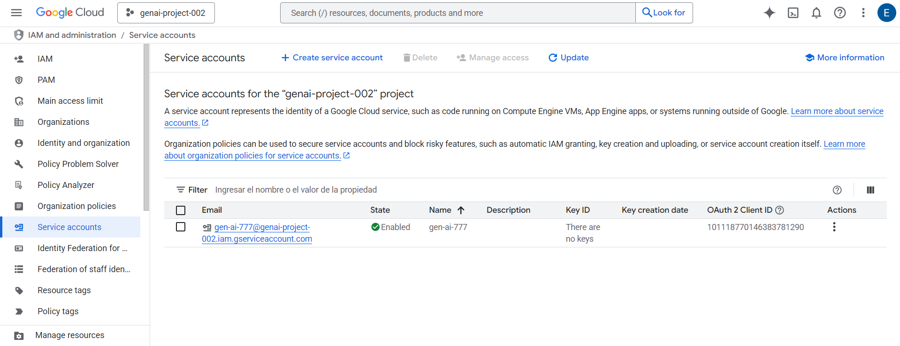

# Vas a Keys y creas una llave en .json 

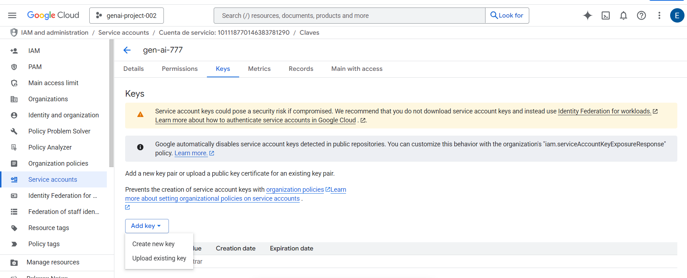

## .json 

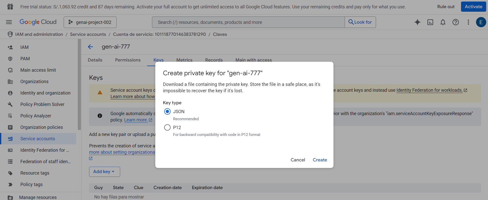

## Se descargará un archivo .json con las credenciales 

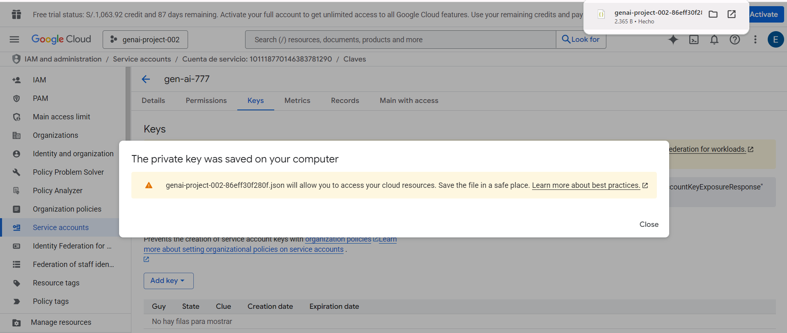

## En tu repositorio subir esta llave en la carpeta principal, recuerda no publicarlo 

Nombre referencial -> genai-project-001-002618acb656.json


## Recuerda darle permisos a Vertex AI de usar su API 

https://cloud.google.com/vertex-ai/docs/start/cloud-environment?utm_source=chatgpt.com&hl=es-419

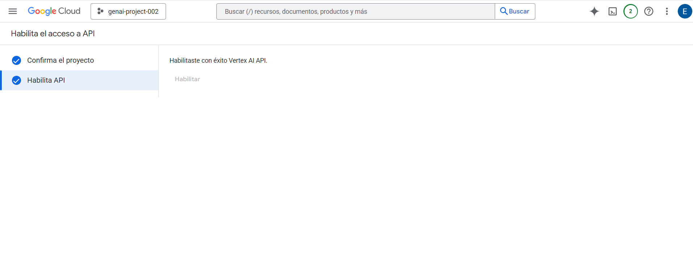

### PARTE 02 - API GEMINI 

Vas a este enlace 

https://aistudio.google.com/apikey

Y creas tu APIKEY

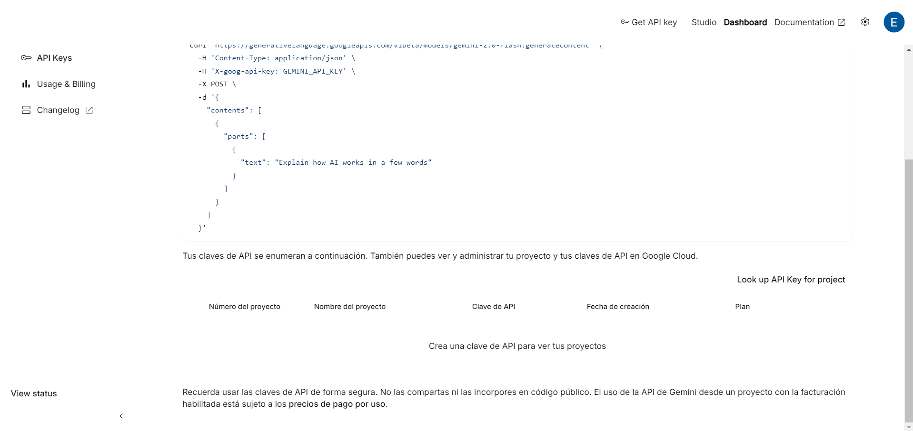


Selecciona el proyecto que creamos y crea tu API KEY 

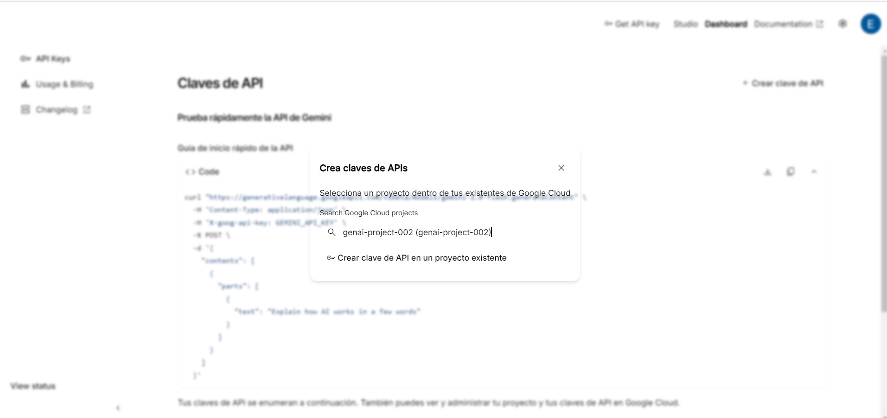

Actualizas tu credencial en .env


## Actualiza el .env 
ejemplo .env
```
# === API pública (rápido para desarrollo) ===
GOOGLE_API_KEY=TUKEY
GEMINI_MODEL=gemini-2.5-flash-lite
FORCE_GEMINI_PUBLIC=true

# === Vertex (prod) ===
GCP_PROJECT=genai-project-001
GCP_LOCATION=us-central1
GOOGLE_APPLICATION_CREDENTIALS=/workspaces/00.Prompt-Engineering-Project-with-GenAI/genai-project-001-002618acb656.json

```

## Verificar que funcionan las API

python 02-check_env_vertex.py
## correr Streamlit 

streamlit run app/app.py

